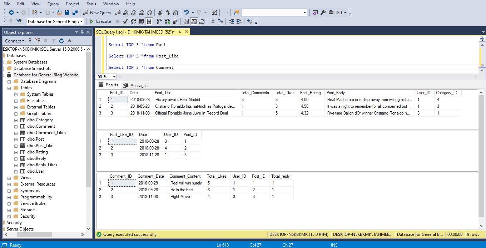
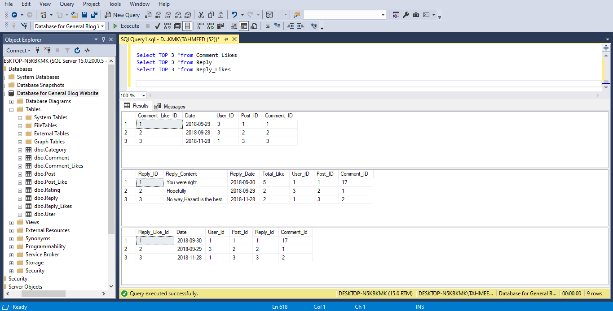
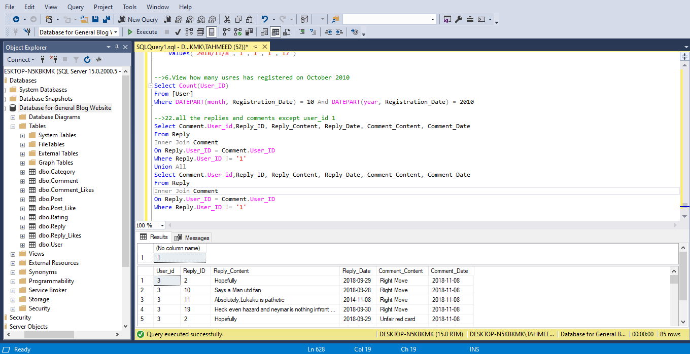

# Database-for-General-Blog-Website

## Table of contents

* [Introduction](#introduction)

* [Features](#features)

* [Technologies](#technologies)

* [Relational Schema](#relational-schema)

* [Entity Relationship Diagram](#entity-relationship-diagram)

* [Demo Screenshots](#demo-screenshots)

* [Setup](#setup)

## Introduction

 It is a database system designed for any dynamic blog website. Every user has an account, and by using the account he can do all the work(create a post, like, comment, reply, etc.) allowed by the administrator of the blog site. All of the user's full name, password, email, post, and other information can be stored in the database. Also, various information about posts, posts categories, comments, likes, replies can be stored in the database.  This group project was built for an undergraduate academic course.

## Features

* User can post articles
* They can like,comment,reply on the posts
* Every user's account information is stored in the database
* User related admin can view all the user's details in the database, update them, and if needed he can also delete user id and other information.
* Post related admin can view all posts, category, rating, likes on a post.
* He can also find out how much likes/ comments the nth most liked/commented post has
* He can edit the post, also how many comments, rating each post has can be easily found.
* He can find out which post has the maximum activity.
* He can find out in which category the  highest-rated posts are present 
* Comment and reply related admin can find the post title, post body, comment of that post with the reply. 
* He can view all replies, comments of each post
* He can find  all the replies after a specific date 
* There are total 9 tables/entities in the database
* 85 useful and distinct queries are demonstrated supporting these features

## Technologies

* Microsoft SQL Server
* Microsoft SQL Server Management Studio
* SQL

## Relational Schema

**Branch** (BID: integer, location: string).  
**Employee** (EID: integer, Ename: string, salary: integer, designation: string, BID: integer).  
**Customer** (Account_number: integer, Customer_name: string, balance: integer, address: string, BID: integer).  
**Transaction** (TID: integer, deposit: integer, withdraw: integer, transaction_date: string, EID: integer, Account_number: integer). 

## Entity Relationship Diagram
 
 
 
 
  <h3>   </h3>

 

 

  
  ## Demo Screenshots
  

 
 
  <h3>   </h3>

 

 

 
 
 
 
  <h3>   </h3>

 

 

 
 
 
 
 
  <h3>   </h3>

 

 

 
 ## Setup
 
Oracle Database should be setup. The SQL scripts should be executed in the order mentioned in the 'Bank-Management-System-Using-Distributed-Database/PROJECT IRRESPECTIVE OF SERVER SITE/SOME PROBLEMS AND REMINDERS.txt' file.

